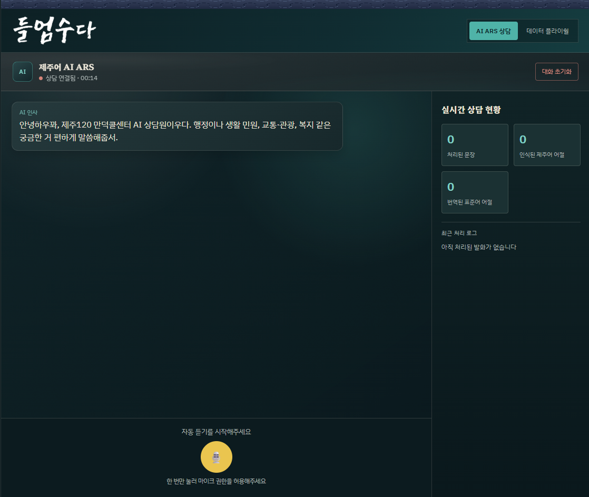

# 들엄수다 | Korean Heritage Web

  

> 제주어 AI ARS 통화와 수집 데이터 검수 화면을 제공하는 Vue 웹 클라이언트입니다.

## 프로젝트 목적

브라우저 음성을 API로 보내고 STT·번역 결과와 AI ARS 응답을 보여줍니다. 데이터 플라이휠 화면에서 수집 발화와 검수 상태를 확인하고 라벨을 수정합니다.

## 핵심 기능

- 음량 감지 자동 녹음: 100ms 발화 확인, 1.2초 무음 또는 30초가 되면 전송.
- 최근 완료 대화 최대 5턴을 localStorage에 보관해 다음 요청에 전달.
- STT·번역·제주어 답변 말풍선, Base64 WAV 재생 및 답변 재생.
- 데이터 통계, Confidence, 오디오·라벨 확인, 라벨 수정·승인·거부 및 페이지 이동.
- 대화 초기화 시 화면, 통계와 저장된 이력을 초기화.

## 아키텍처

~~~mermaid
flowchart LR
  U[브라우저 마이크] --> R[음량 감지·MediaRecorder]
  R -->|file + 최근 history| W[POST /translate]
  W --> API[Jeju AI ARS API]
  API -->|STT·Gemini·선택적 RAG·TTS| OUT[JSON + Base64 WAV]
  OUT --> UI[대화 표시·음성 재생]
  UI --> LS[localStorage]
  D[데이터 플라이휠 탭] -->|통계·샘플·오디오·검수| API
~~~

## 기술 스택

Vue 3, Vite 5, MediaRecorder, Web Audio API, Nginx 1.27, Docker, npm.

## 설치 및 실행

Dockerfile 기준 Node.js 20입니다.

~~~bash
npm ci
npm run dev
~~~

별도 터미널에서 프로덕션 빌드와 미리보기를 실행합니다.

~~~bash
npm run build
npm run preview
~~~

~~~bash
docker build -t korean-heritage-web .
docker run --rm -p 8080:8080 korean-heritage-web
~~~

## 환경 변수

| 변수 | 기본값 | 설명 |
|---|---|---|
| VITE_API_URL | http://localhost:8000 | API 주소. Vite 빌드 때 번들에 반영됩니다. |

~~~powershell
$env:VITE_API_URL = "https://jeju-backend-385248657749.asia-northeast3.run.app"
npm run dev
~~~

## API 및 데이터 흐름

POST /translate는 multipart의 file 및 최근 최대 5턴 JSON 배열 history를 받습니다. 응답의 jeju_text, standard_text, ars_reply_text를 화면에 표시하고 audio_base64를 재생합니다.

| Method | 경로 | 목적 |
|---|---|---|
| GET | /dataset/stats | 전체·pending·approved·rejected 개수 |
| GET | /dataset/samples?limit=20&offset=0 | 샘플 페이지 |
| GET | /dataset/audio/{sample_id} | WAV 재생 |
| PATCH | /dataset/samples/{sample_id} | 상태·선택 라벨 수정 |

백엔드 세부사항은 [API 저장소](https://github.com/sunghopp/Korean-Heritage-API-SVR)를 참고하세요.

## 디렉터리 구조

~~~text
.
├── src/assets/
├── src/components/
├── src/composables/
├── src/services/
├── src/App.vue
├── src/main.js
├── src/style.css
├── Dockerfile
├── nginx.conf
├── package.json
└── vite.config.js
~~~

## 학습 및 평가 지표

이 저장소에는 모델 학습·평가 코드가 없습니다. 화면의 턴 수와 단어 수는 브라우저 사용 통계입니다.

## 주의사항

- 마이크 권한이 필요하며 배포 시 HTTPS를 사용해야 합니다.
- VITE_API_URL은 빌드 시점 값입니다. 컨테이너 실행 때 설정해도 바뀌지 않습니다.
- 현재 백엔드 대시보드 API에는 인증이 없으므로 데이터 접근 권한을 확인하세요.
- 브라우저가 자동 재생을 막으면 AI 말풍선을 눌러 다시 재생할 수 있습니다.
